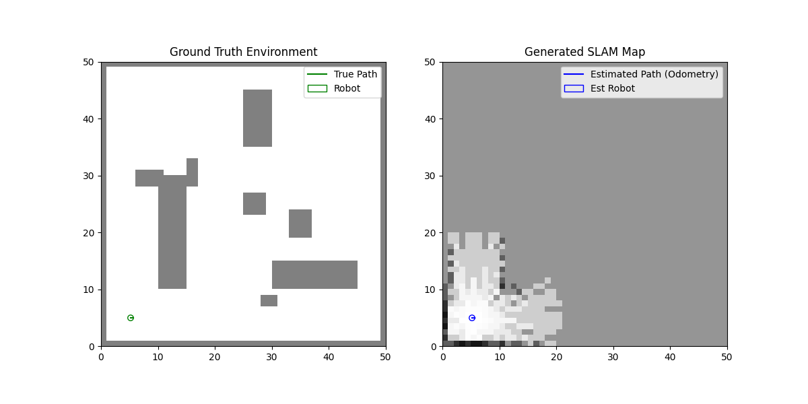
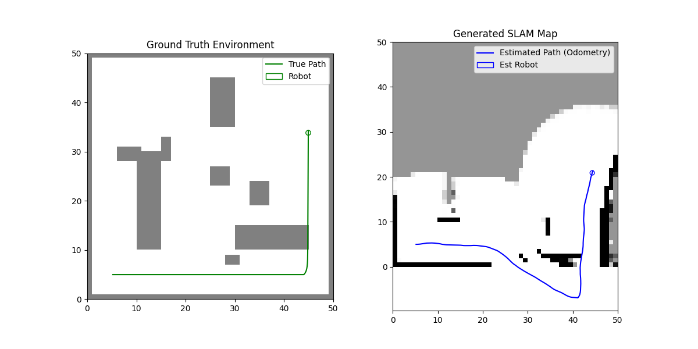
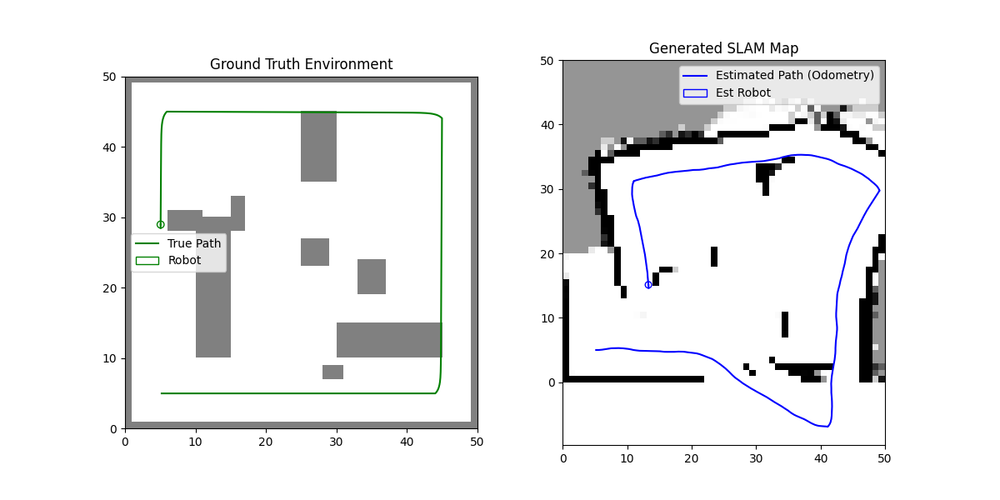
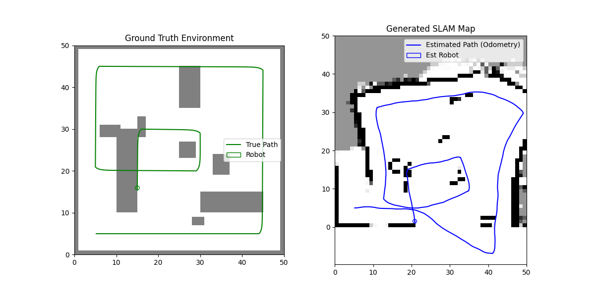

<p align="center">
  <h1 align="center">🎓 MSc Artificial Intelligence — Coursework</h1>
  <p align="center">
    <strong>Jomo Kenyatta University of Agriculture and Technology (JKUAT)</strong><br>
    <em>A curated collection of assignments, projects, and research across the MSc AI programme</em>
  </p>
  <p align="center">
    
    
    
  </p>
</p>

---

## 📋 Table of Contents

- [Overview](#-overview)
- [Repository Structure](#-repository-structure)
- [Modules](#-modules)
  - [Semester 1 — Foundations](#1-semester-1--foundations)
  - [Computer Vision](#2-computer-vision)
  - [Deep Learning](#3-deep-learning)
  - [Natural Language Processing](#4-natural-language-processing)
  - [Robotics](#5-robotics)
  - [Ethics & Governance in AI](#6-ethics--governance-in-ai)
  - [Research Methodology](#7-research-methodology)
- [Tech Stack](#-tech-stack)
- [Getting Started](#-getting-started)
- [Author](#-author)
- [License](#-license)

---

## 🔭 Overview

This repository contains the coursework, projects, and research artefacts produced during my **MSc in Artificial Intelligence** at JKUAT. Each module folder is self-contained with Jupyter notebooks, Python source code, reports, and supplementary materials.

The work spans the full breadth of the AI curriculum — from foundational algorithms and mathematical optimisation through deep learning architectures, computer vision, NLP, autonomous robotics, and the ethical governance of AI systems.

---

## 📁 Repository Structure

```
Msc-AI-Coursework/
├── Sem1/                           # Semester 1 — Foundational AI modules
├── Computer Vision/                # Image processing, feature detection, Seq2Seq
├── Deep Learning/                  # MLP, CNN, RNN/GRU, Hamming Networks, SOM
├── Natural Lang Processing/        # Kamba–English Neural Machine Translation
├── Robotics/                       # SLAM-based mapping robot simulation
├── Ethics & Governance in AI/      # AI policy, sovereignty & governance synthesis
├── Research Methodology/           # MSc research proposal & prototype
└── .gitignore
```

---

## 📚 Modules

### 1. Semester 1 — Foundations

> *Core AI algorithms, optimisation, and Python fundamentals*

| Notebook / File | Topic |
|:--|:--|
| `AI_Algos_Assigment.ipynb` | AI search algorithms — Assignments 1–4 |
| `Python4AI.ipynb` | Python programming for AI applications |
| `fuzzy_logic.py` | Fuzzy inference engine (triangular & trapezoidal MFs) |
| `Tipping_Soln.ipynb` | Fuzzy logic tipping system with multiple membership functions |
| `MILP.ipynb` | Mixed-Integer Linear Programming — warehouse routing optimisation |
| `perceptron.ipynb` | Single-layer perceptron implementation |
| `K_Seaman_Q2.ipynb` | Additional assignment solutions |
| `Random Unknown.py` | A* pathfinding with unknown obstacles on a grid |
| `Search Unknown.py` | Search algorithms in partially observable environments |

---

### 2. Computer Vision

> *Image processing, feature detection, and sequence-to-sequence architectures*

| Notebook / File | Topic |
|:--|:--|
| `Solution_CV.ipynb` | Fourier-based noise removal, Canny edge detection, Hough transform, Harris corners |
| `Assignment_2.ipynb` | Advanced CV techniques |
| `Term_Paper.ipynb` | **Comparative Analysis of Seq2Seq Architectures** — Case study of Google's Show-and-Tell image captioning framework |

**Key Techniques:** FFT spectral filtering · Canny edge detection · Hough line transform · Harris corner detection · Encoder-decoder architectures

---

### 3. Deep Learning

> *ICS 3308 — From perceptrons to recurrent networks and competitive learning*

| Notebook / File | Topic |
|:--|:--|
| `Assignment_1_MLP_House_Prices.ipynb` | **MLP** for house price prediction (California Housing dataset) |
| `Assignment_2_CNN_Image_Classification.ipynb` | **CNN** for image classification (CIFAR-10) |
| `Assignment_3_RNN_vs_GRU.ipynb` | **RNN vs GRU** comparison on time-series data |
| `hamming_network.py` / `.ipynb` | Hamming network for pattern recognition |
| `self_organizing_map.py` / `.ipynb` | Kohonen Self-Organising Map — unsupervised colour clustering |
| `winner_takes_all.py` / `.ipynb` | Winner-Takes-All competitive learning network |
| `ICS_3308_Deep_Learning_QP_Solutions.ipynb` | Past paper solutions |

<p align="center">
  
  
  
</p>

---

### 4. Natural Language Processing

> *Kamba–English bidirectional neural machine translation*

Built a full **NMT pipeline** for Kamba (*Kikamba*), an under-resourced Bantu language spoken by ~4.7 million people in south-eastern Kenya.

| Notebook | Description |
|:--|:--|
| `Machine_Translation.ipynb` | Local development notebook |
| `Machine_Translation_Colab_V1–V4.ipynb` | Iterative Colab training runs |

**Architecture:** Marian NMT (`Helsinki-NLP/opus-mt-en-bnt`) · Full-parameter fine-tuning · bf16 precision · 51K parallel sentence pairs

<p align="center">
  
</p>

---

### 5. Robotics

> *Perception & Kinematics — SLAM-based mapping robot*

A standalone Python simulation implementing **Simultaneous Localisation and Mapping (SLAM)** with:

- **Differential drive kinematics** with noisy odometry
- **2D LiDAR ray-casting** sensor simulation
- **Log-odds occupancy grid mapping** using Bresenham's line algorithm

| File | Role |
|:--|:--|
| `environment.py` | 2D environment with static obstacles and LiDAR simulation |
| `robot.py` | Differential drive kinematics and odometry |
| `slam.py` | Occupancy grid map with log-odds updates |
| `main.py` | Simulation loop, waypoint navigation, and visualisation |

```bash
# Run the simulation
uv run main.py
```

<p align="center">
  
  
  
  
</p>

---

### 6. Ethics & Governance in AI

> *Critical inquiry into global AI regulatory architectures, ethical frameworks, and the Global South perspective*

| File | Description | Format |
|:--|:--|:--|
| [`AI_G&E_Term_Paper.pdf`](Ethics%20&%20Governance%20in%20AI/AI_G&E_Term_Paper.pdf) | **Term Paper:** *AI Governance and Ethics: Frameworks and Challenges* — Full analytical paper covering all required governance subtopics | PDF (Compiled) |
| [`Ethics-and-Governance-of-AI-Synthesis.pdf`](Ethics%20&%20Governance%20in%20AI/Ethics-and-Governance-of-AI-Synthesis.pdf) | Foundational synthesis report from the ICRIER Prosus Centre for Internet and Digital Economy (IPCIDE) webinar series (October 2025 – January 2026) | PDF (Source) |

> 📌 **Coursework Assignment Brief:**
>
> *"Read the synthesis report on Ethics and Governance of AI drawing perspectives from the webinar series convened by The ICRIER Prosus Centre for Internet and Digital Economy (IPCIDE) from October 2025 to January 2026.*
>
> *Based on this Synthesis report, develop a term paper titled, **AI Governance and Ethics: Frameworks and Challenges** under the following subtopics:*
> 1. *Introduction*
> 2. *Problem statement*
> 3. *Overview of AI Governance*
> 4. *Current frameworks (including The role of Private sector Governance)*
> 5. *Ethical Considerations in AI (Bias and Fairness, Privacy and data Protection, Transparency and explainability, Accountability and Responsibility)*
> 6. *Future considerations*
> 7. *Conclusions and Recommendation*
> 8. *References"*

#### 📑 Term Paper Structure & Key Highlights

The completed term paper directly addresses the coursework brief through a rigorous analytical exploration:

- **1. Introduction** — Situating generative and agentic AI governance within accelerating geopolitical tensions, compute monopolies, and institutional fragmentation.
- **2. Problem Statement** — Examining structural asymmetries in the AI value chain, material and environmental exploitation, Global South digital sovereignty deficits, and technocratic engagement gaps.
- **3. Overview of AI Governance** — Core principles, institutional mandates (UNESCO, OECD, G20, AU), and international coordination mechanisms.
- **4. Current Frameworks** — Comparative analysis of the EU AI Act (risk-tiered approach), US Executive Orders (market-driven standards), and BRICS multilateral approaches:
  - **The Role of Private Sector Governance** — Corporate self-regulation limits, upstream–downstream liability allocation gaps, and antitrust/competition policy interventions.
- **5. Ethical Considerations in AI**:
  - **Bias and Fairness** — Algorithmic discrimination, unrepresentative demographic datasets, and systemic allocative harms.
  - **Privacy and Data Protection** — Surveillance capitalism, non-consensual biometric scraping, and cross-border data sovereignty.
  - **Transparency and Explainability** — Black-box opacity, model auditability, interpretability techniques, and disclosure requirements.
  - **Accountability and Responsibility** — Strict liability regimes, provenance tracking, and supply chain accountability.
- **6. Future Considerations** — Operationalising the **SCAIS framework**, securing the sovereign AI stack (**KASE: Knowledge, Compute, Sovereign Cloud, Data**), and conceptualising AI as **Digital Public Infrastructure (DPI)**.
- **7. Conclusions and Recommendations** — Actionable policy roadmaps for developing nations balancing technological innovation with fundamental rights and digital sovereignty.
- **8. References** — Comprehensive citations across peer-reviewed literature, global statutes, and multilateral policy reports.

**Key Themes:** EU AI Act · US Executive Orders · Global South & BRICS Perspectives · Data Sovereignty vs. Data Colonialism · Algorithmic Accountability · Environmental Costs of AI

---

### 7. Research Methodology

> *MSc research proposal — Culturally-adapted conversational AI for Kenyan youth mental health*

| File | Description |
|:--|:--|
| `Proposal_Kinyua_Seaman.pdf` | Full research proposal |
| `CompanionAI+Research+Programme.pdf` | Research programme overview |
| `blog.html` | Research blog post |
| `ca_ai/` | **CompanionAI prototype** — Clean Architecture Python backend |

**Research Focus:** RAG-based cultural adaptation · Causal inference for therapeutic efficacy · Graph neural networks · UCLA Loneliness Scale · Azure AI Search pipeline

The `ca_ai/` prototype implements:
```
ca_ai/
├── core/           # Domain logic: clinical rules, prompt builder, protocols
├── adapters/       # External service interfaces (mock adapters)
├── use_cases/      # Application business logic (chat interaction)
├── api/            # FastAPI entry point
├── infrastructure/ # Infrastructure concerns
└── tests/          # Unit and integration tests
```

---

## 🛠 Tech Stack

| Category | Technologies |
|:--|:--|
| **Languages** | Python 3.10+ |
| **ML/DL** | PyTorch, TensorFlow/Keras, scikit-learn, HuggingFace Transformers |
| **Computer Vision** | OpenCV, NumPy, Matplotlib |
| **NLP** | Marian NMT, SentencePiece, NLTK |
| **Data Science** | Pandas, NumPy, SciPy |
| **Optimisation** | PuLP (MILP), scikit-fuzzy |
| **Robotics** | Custom SLAM simulation (NumPy + Matplotlib) |
| **Backend** | FastAPI, Azure AI Search |
| **Package Management** | uv, pip |
| **Notebooks** | Jupyter, Google Colab |

---

## 🚀 Getting Started

```bash
# Clone the repository
git clone https://github.com/KeSeaman/Msc-AI-Coursework.git
cd Msc-AI-Coursework

# Open any notebook
jupyter notebook

# For the Robotics simulation
cd Robotics
uv run main.py
```

> **Note:** Large datasets (e.g., YouTube Faces keypoints for CV) are excluded from the repository via `.gitignore`. Download them separately if needed.

---

## 👤 Author

**Kinyua Seaman**
- GitHub: [@KeSeaman](https://github.com/KeSeaman)

---

## 📄 License

This repository is for educational and portfolio purposes. Individual assignments remain subject to JKUAT academic policies.
